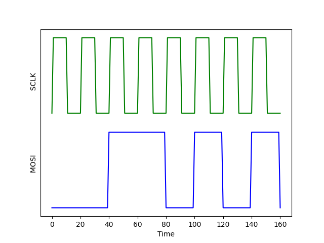

# Lab 3 BitBang SPI
In this lab we will be implementing SPI using GPIO. You may encounter devices in the field which are severely resource constraint and do not come with a number of peripherals, here we are trying to solve such a problem. We assume that the device that we have to work with does not have a hardware SPI implementation and as such we must implement it using GPIO so that we can attach devices that communicate using SPI.

# Part 1 - Reading signals (10%)
First of all we need to understand how the signals are transmitted. Here's an output similar to one you will be able to see based on your implementation, identify what data has been transmitted in the image.

# Part 2 - Implementation (80%)
Now we will be implementing a half-duplex BitBang SPI; BitBanging is the practice of using GPIO to emulate a peripheral, generally a hardware peripheral comes with various optimisations but when resources are scarce we need to go down this road. You can come across BitBanging in Arduino as well! Arduino Uno has only 1 UART and as such if you want to connect multiple things using UART then we need to make software based UART using GPIO.

Use the file `part2.c` to write your code and then run it by selecting `Lab_3` in the **Run Lab** task. After the code runs you should either get an error or an image in this folder named `output.png`, ensure that your signal is transmitted correctly using the image.

# Part 3 - Observations (10%)
Answer the following questions based on your experience with the implementation of the SPI Peripheral:
1. Is adding a delay required for synchronization of the communication? Why / Why not?
2. Are start and stop bits required for tranmission? Why / Why not?

### Hints
* Remember which direction time goes in an oscilloscope's reading